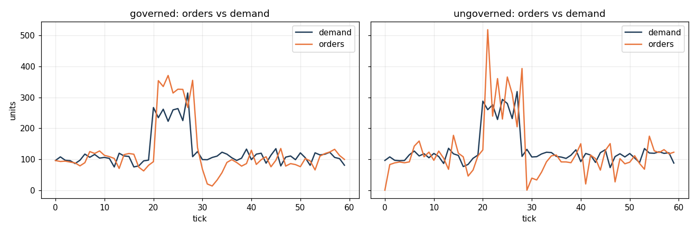
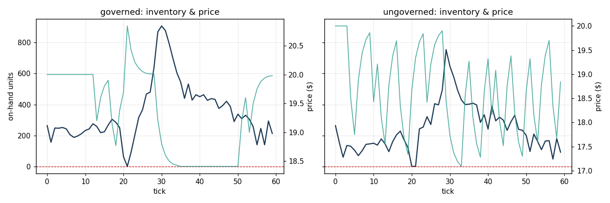

# stockout-mas

This project is a runnable prototype of a **multi-agent supply-chain stockout response system**. I use a simple retail setting: one product, unstable demand, several suppliers, and a price lever that can either help the business or make a shortage worse.

The goal is not to build a production supply-chain platform. The goal is to show, in code, why the problem needs more than one decision-maker. Demand forecasting, replenishment, supplier selection, pricing, and human approval all have different information and different incentives. When those pieces are separated into agents, the system can show the coordination problems that a single model would hide.

The prototype compares two modes:

- **governed**: the agents coordinate through a supervisor, a shared blackboard, a supplier auction, approval checks, a circuit breaker, and rollback.
- **ungoverned**: key guardrails are removed, so local decisions can interact badly.

The main failures I wanted to test are the **bullwhip effect** and a **pricing-vs-inventory conflict**. The project includes the code, docs, tests, generated charts, and evaluation outputs needed to reproduce the result.

```bash
# install everything needed for tests and plots
pip install -e ".[dev,plots]"

# run one scenario and print a readable message transcript
PYTHONPATH=src python -m stockout_mas.run --scenario governed --transcript 6

# compare all scenarios and regenerate charts in outputs/
PYTHONPATH=src python -m stockout_mas.eval.run_eval

# run the 200-seed tail-risk stress test
PYTHONPATH=src python -m stockout_mas.eval.stress --runs 200

# run tests
PYTHONPATH=src pytest -q
```

---

## 1. System brief

A retailer is trying to keep a shelf stocked during a demand spike. Demand rises suddenly, suppliers have different costs and lead times, and the pricing team can change price to shape demand. That sounds simple until the incentives start to clash.

For example, if sales slow down during a shortage, a pricing agent that only cares about revenue may think, “demand is weak, cut price.” But the real reason sales are low is that there is not enough stock. Cutting price in that moment can increase demand into an empty shelf and make the shortage worse.

That is the kind of failure this project is designed to make visible.

More detail is in [`docs/system-brief.md`](docs/system-brief.md).

## 2. Why this is a multi-agent system

A single model could output a forecast, an order quantity, a supplier, and a price. I did not use that design because it would merge responsibilities that are separate in the real problem.

The useful separation is:

- **Demand** estimates what is likely to be sold.
- **Inventory** decides how much stock is needed.
- **Suppliers** bid or decline based on their own capacity, cost, lead time, and reliability.
- **Pricing** changes demand by moving the price.
- **Approver / HITL** gates actions that have enough financial or operational risk to need human oversight.
- **Orchestrator** routes messages, runs the supplier auction, applies governance, and writes the audit trail.

The hard part is not one formula. The hard part is how those roles affect each other. That is why a multi-agent design is a better fit for this assignment than a single inventory controller.

This project also connects to my earlier single-agent inventory RL work (`EBIOKEREIN/inventory-rl`). That kind of controller could be useful inside the inventory agent through the `policy_fn` hook, but it would not replace the full multi-agent coordination problem.

## 3. Agent roster

Each agent has one main job and limited permissions. Agents do not directly change the environment. They send messages and the orchestrator commits approved actions. That design keeps decisions traceable.

| Agent | Main job | Emits |
|---|---|---|
| Demand | Forecast short-term demand | `FORECAST` |
| Inventory | Request replenishment | `REPLENISH_REQUEST` |
| Supplier A/B/C | Bid for orders or decline | `BID` / decline |
| Pricing | Propose price changes | `PRICE_UPDATE` |
| Approver / HITL | Approve, reject, or escalate risky actions | `APPROVAL_RESPONSE` |
| Orchestrator | Sequence, route, audit, govern | `CFP`, `AWARD`, `CIRCUIT_BREAK`, `ROLLBACK` |

Full details are in [`docs/agent-roster.md`](docs/agent-roster.md).

## 4. Coordination mechanism

The project uses a **hybrid coordination design** because one pattern alone is not enough.

| Pattern | Where it is used | Why it is there |
|---|---|---|
| Supervisor | The orchestrator owns the tick order, routing, audit, circuit breaker, and rollback | I need one clear place where control and governance happen |
| Contract-net | Supplier selection uses `CFP → BID → AWARD` | Suppliers are external parties that can bid or decline, so sourcing is a negotiation |
| Blackboard | Shared state stores forecast, inventory position, price, and stock-health | Agents can share important signals without directly calling each other |

The orchestrator keeps the run deterministic and auditable. The contract-net gives the supplier side a real market mechanism. The blackboard keeps agents decoupled while still letting pricing see stock-health.

Architecture and sequence diagrams are in [`docs/architecture.md`](docs/architecture.md), and the design reasoning is in [`docs/coordination.md`](docs/coordination.md).

## 5. Communication contract

Every agent interaction uses the same typed `Message` envelope. The important fields are `sender`, `recipients`, `msg_type`, `performative`, `conversation_id`, `correlation_id`, and `payload`.

I used `conversation_id` and `correlation_id` because a supplier negotiation has multiple related messages. If the orchestrator awards an order to a supplier, the audit log can reconstruct the original request for proposal, every bid, and the final award decision.

Agents do not call each other directly. They communicate through the orchestrator and shared state. That makes the message flow easier to inspect and much easier to govern.

Full schema and a real transcript are in [`docs/comms-contract.md`](docs/comms-contract.md).

## 6. Emergent behaviour

The project shows both expected and unwanted emergent behaviour.

### Expected emergence

The governed system becomes more stable because the agents share enough information to avoid working against each other. Inventory can respond to a demand shock, suppliers can be selected through an auction, and pricing can avoid moves that would worsen a shortage.

### Unwanted emergence 1: bullwhip

Small changes in demand can become much larger changes in orders. In the ungoverned run, orders overshoot to around 520 units while demand peaks around 290 units. The governed run uses smoothing and a circuit breaker, so orders stay closer to actual demand.



### Unwanted emergence 2: pricing-vs-inventory conflict

In the ungoverned run, pricing reacts to weak sales by marking down, even when weak sales are caused by low inventory. That increases demand when the shelf is already empty. The governed run uses a stock-health signal so price cuts are blocked during shortage conditions.



These behaviours are not hard-coded as “failures.” They appear because separate agents pursue local objectives and then affect each other through the environment.

## 7. Incentives

The system-level goal is profit with a high service level, but no single agent sees the whole objective.

| Agent | Local objective | Possible problem |
|---|---|---|
| Demand | Reduce forecast error | Forecast bias can mis-size downstream orders |
| Inventory | Hit service target cheaply | Chasing target too aggressively can create bullwhip |
| Supplier | Win profitable orders | May decline or price in capacity pressure |
| Pricing | Improve revenue / clear stock | May cut price during a shortage |
| Approver | Enforce policy | Slows the system, but protects it from unsafe actions |

The main design choice is to correct misalignment without pretending every agent has the same objective. The governed system uses a stock-health signal, an expedite cost, approval gates, and a circuit breaker to make harmful local actions harder to take.

More detail is in [`docs/incentives.md`](docs/incentives.md).

## 8. Interoperability

The prototype runs in one Python process, but the boundaries are drawn so the design could move to standard agent/tool protocols later.

- **A2A-style boundary:** the supplier edge. Suppliers are independent actors, so the `CFP`/`BID`/`AWARD` exchange is the natural place for agent-to-agent communication.
- **MCP-style boundary:** tools and state. Blackboard reads, environment actions such as `place_po` and `set_price`, and agent scopes map naturally to a tool/resource permission model.

The practical rule is: use A2A-style communication between independent agents, and MCP-style access for the tools and data an agent is allowed to use.

## 9. Safety, governance, and operations

The governance layer is there because the system can place orders and move prices. Those are real business actions, so the prototype treats safety as part of the architecture rather than an afterthought.

The main controls are:

- **Human-in-the-loop approval:** high-value orders and large price moves require approval or escalation.
- **Append-only audit:** every message and governance event is logged.
- **Circuit breaker:** runaway orders are clamped to a safe band and escalated.
- **Rollback:** the environment snapshots state each tick so a bad move can be reverted.

The safety plan also names known gaps: the human approver is mocked, there is no production identity/auth layer, and the audit log is not yet tamper-evident. Those are acceptable for a prototype, but they are not ignored.

See [`docs/safety-governance.md`](docs/safety-governance.md).

## 10. Evaluation

The evaluation is split into four levels because failures can happen at different layers.

| Level | What I measure |
|---|---|
| Agent | forecast error, order volatility, price volatility |
| Interaction | bullwhip ratio, messages, contract-net rounds, circuit-breaks |
| System | fill rate, lost units, profit |
| Human | approvals, auto-approvals, escalations |

Single-seed results show the governed system is mainly buying stability rather than huge average-profit improvement. The stress test is more important because it shows tail risk.

**200-seed stress test:**

| | governed | ungoverned |
|---|---|---|
| fill mean | **98.98%** | 97.75% |
| fill min (worst) | **95.51%** | 93.40% |
| profit mean | **18,427** | 17,859 |
| profit min (worst) | **14,278** | 11,204 |

The governed version has a higher service floor and a higher profit floor. That is the best argument for the guardrails: they reduce downside risk, even when the average case does not look dramatic.

Full evaluation is in [`docs/evaluation.md`](docs/evaluation.md).

## 11. MARL bridge

Multi-agent reinforcement learning is relevant in theory, but I do not use it as the main prototype.

This problem can be described as a partially observable multi-agent decision problem: each agent sees part of the environment, acts locally, and contributes to a global outcome. MARL could be useful later in simulation, especially for learning a better replenishment policy or testing coordination strategies.

For this version, I kept the policies explicit for four reasons:

1. **Auditability:** a rule like “do not mark down when stock-health is low” is easy to inspect.
2. **Sample cost:** supply-chain learning would need many episodes that real businesses do not have.
3. **Credit assignment:** a stockout may be caused by a forecast miss, a pricing move, a supplier delay, or an ordering decision several ticks earlier.
4. **Governance:** the assignment asks for a safety story, and explicit rules are easier to govern than a black-box joint policy.

The bridge is the `policy_fn` hook in the inventory agent. A learned policy can replace the analytic replenishment rule later without changing the message contract or governance layer.

## Repo map

```text
src/stockout_mas/
  messages.py        typed Message envelope and enums
  config.py          parameters and guardrail toggles
  blackboard.py      shared state with history
  audit.py           append-only message and event log
  orchestrator.py    supervisor: tick loop, supplier auction, breaker, rollback
  agents/            demand, inventory, supplier, pricing, approver, base
  sim/               environment, demand process, PO pipeline, scenarios
  eval/              metrics, scenario comparison, stress test
  run.py             CLI for one scenario and transcript

docs/                system brief, agent roster, architecture, communication,
                     coordination, incentives, evaluation, safety governance

tests/               pytest checks for invariants the safety story depends on
outputs/             generated charts, metrics, and sample audit log
```

## Reproducibility

The simulation is deterministic for a given seed. The single-run tables use `seed=7`; the stress test sweeps seeds `1000–1199`. Running the commands at the top regenerates the charts and metrics.

## Contribution statement

Solo project. I designed and implemented the prototype, including the agent roles, coordination mechanism, simulation environment, governance layer, evaluation scripts, documentation, and generated outputs.
