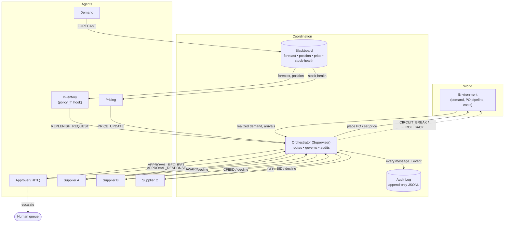

# Architecture

The architecture is built around one simple rule: agents can propose and communicate, but the orchestrator is the only component that commits changes to the environment. That keeps the system traceable and gives the governance layer a clear place to act.

## Component view



## Why these pieces are separated

- The **environment** holds the simulated world: inventory, realized demand, purchase orders in transit, price, and costs.
- The **blackboard** holds shared state that agents need but should not privately own.
- The **orchestrator** controls sequencing and governance.
- The **audit log** records routed messages and governance events.
- The **human queue** is where escalations go when an action should not be auto-approved.

This separation matters because the system has to explain not only what decision was made, but also where the decision came from and which controls were applied.

## Coordination patterns used

The architecture combines three coordination patterns:

| Pattern | Role in the system |
|---|---|
| Supervisor | The orchestrator determines the tick order, routes messages, runs governance, and writes the audit log |
| Blackboard | Forecasts, positions, price, and stock-health are shared without agents directly depending on each other |
| Contract-net | Suppliers receive a request for proposal, respond with bids or declines, and the orchestrator awards the order |

I used the hybrid because each pattern solves a different part of the problem. The supervisor gives control, the blackboard gives shared context, and contract-net gives a real supplier negotiation.

## Tick sequence

Each tick follows the same five phases.

```mermaid
sequenceDiagram
    participant D as Demand
    participant O as Orchestrator
    participant P as Pricing
    participant A as Approver
    participant I as Inventory
    participant S as Suppliers
    participant E as Environment

    Note over O: SENSE
    D->>O: FORECAST (μ, σ)
    O->>O: update stock-health on blackboard

    Note over O: PRICE
    P->>O: PRICE_UPDATE
    O->>A: APPROVAL_REQUEST when move is outside policy band
    A-->>O: approve / reject / escalate

    Note over O: PLAN
    I->>O: REPLENISH_REQUEST

    Note over O: GOVERN
    O->>O: check for runaway order; clamp and escalate if needed

    Note over O: SOURCE
    O->>S: CFP
    S-->>O: BID / decline
    O->>S: AWARD / NO_AWARD
    O->>A: APPROVAL_REQUEST when value is above threshold
    A-->>O: approve / reject / escalate

    O->>E: commit approved PO and price
    E-->>O: realized demand, arrivals, costs
    Note over O: write messages and events to audit log
```

## Why the order matters

Pricing happens before sourcing because the price affects demand and therefore the stockout risk. Governance happens before sourcing because a runaway order should be caught before money is committed. The environment is updated last so the tick has a clear “propose → check → commit” structure.

## Code map

| Path | Role |
|---|---|
| `messages.py` | typed message envelope and enums |
| `config.py` | parameters, thresholds, and guardrail toggles |
| `blackboard.py` | shared state store with history |
| `audit.py` | append-only log of messages and governance events |
| `agents/` | demand, inventory, supplier, pricing, approver, base classes |
| `orchestrator.py` | supervisor loop, routing, supplier auction, circuit breaker, rollback |
| `sim/environment.py` | demand process, PO pipeline, cost accounting, snapshots |
| `sim/scenarios.py` | governed, no_smoothing, ungoverned, supplier_outage configs |
| `eval/metrics.py` | agent, interaction, system, and human metrics |
| `eval/run_eval.py` | scenario comparison and chart generation |
| `eval/stress.py` | Monte-Carlo tail-risk sweep |
| `run.py` | CLI for one scenario and transcript |
